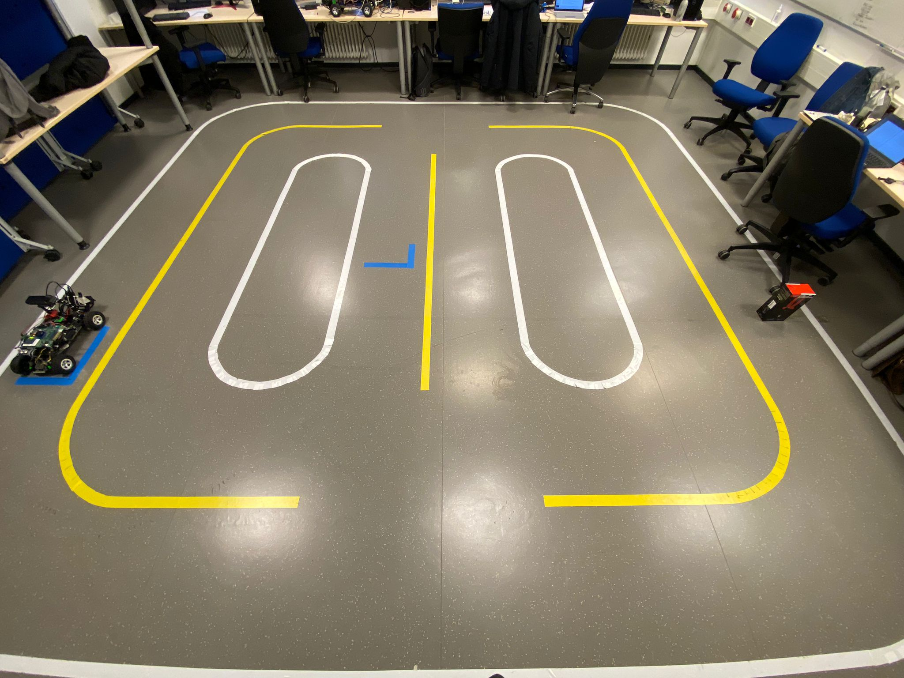
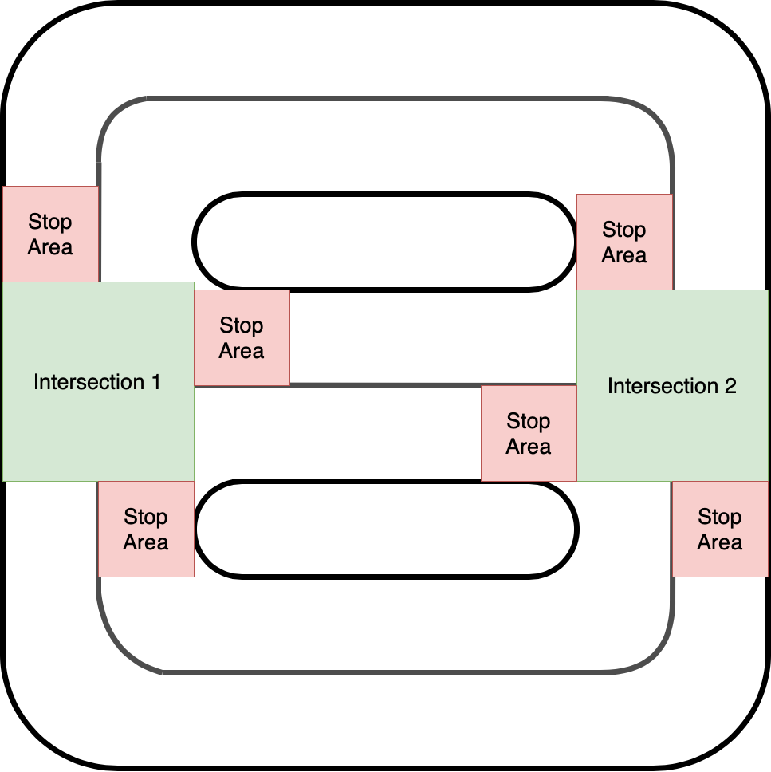

# AutonomROS: Autonomous Car Swarm with Hardware-accelerated ROS Programming

We present an Ackermann-based autonomous driving robot car based on  an [ROS 2](https://docs.ros.org/en/galactic/index.html) architecture alongside accelerated computationally intensive components using hardware acceleration through [ReconROS](https://github.com/Lien182/ReconROS) on an [Zynq UltraScale+ MPSoC ZCU104](https://www.xilinx.com/products/boards-and-kits/zcu104.html) FPGA board. First, our robot car can drive in a lane at a predefined speed. Second, it can detect obstacles and avoid collisions by stopping. Third, our car prevents intersection collisions with other vehicles by communicating via Wifi to a virtual traffic light offering smooth intersection coordination. Finally, since our developed architecture builds upon [Navigation 2 (Nav2)](https://navigation.ros.org/), a commonly used ROS 2 framework, we provide smooth integration and extendability. Furthermore, we accelerated three computationally intensive architecture components, lane detection, point cloud calculation, and obstacle detection, to save CPU time. In addition, we discovered that leveraging shared memory through [Iceoryx](https://iceoryx.io/latest/) as the ROS 2 middleware further reduced CPU time. Hence, we extended ReconROS’s capabilities by
making it compatible with Iceoryx.

<div align="center">
  
</div>

<div align="center">
    
    
    
    
</div>

<div align="center">
    
    
</div>

## Demo Video

<div align="center">
  <a href="https://www.youtube.com/watch?v=INDCgiEQBtc"></a>
</div>

## Hardware

- Zynq UltraScale+ MPSoC ZCU104
- Traxxas Racecar Slash 2WD
- Ultrasonic Sensor (HC-SR04)
- Hall Sensor (KY-024)
- IMU (BNO055)
- PMOD0 Breakout Board
- 2D-Camera (SeeCam Cu30)
- 3D-Camera (Astra Pro)
- Wifi Sticks (TP Link TL-WN823NV3)
- Powered USB Hub (CSL USB Hub 3.2 Gen1)
- MakerBeams

## Tested on

- Ubuntu 20.04 LTS (Focal Fossa)
- ROS 2 Galactic
- Vivado 2021.2
- amd64 architecture (PC)
- arm64 architecture (ZCU104)

For more detailed information regarding dependencies consider the `ansible` folder

## Installation

### 0. Install git

If git is not already installed on your computer, install it with:

```bash
sudo apt install git
```

### 1. Clone the repository

```bash
git clone git@git.uni-paderborn.de:clienen/autonomros.git
```

### 2. Initialize the submodules

Change into the root of the repository and run the following command:

```bash
git submodule update --init
```

### 3. Initialize environment

We provide a recommended way to install all requirements using Ansible, which might cause changes on your system. Otherwise look into the ansible playbooks and follow the steps manually.

#### 3.1 Install Ansible

You can either run our script `first_install.sh` or look into the documentation of Ansible.
!We do not provide any warranty for potential damages!

```bash
ansible/scripts/first_install.sh
```

#### 3.2 Run Ansible

```bash
source ~/venvs/ansible/bin/activate
cd ansible/
ansible-playbook -i hosts.yml lab.yml -K --extra-vars "main_user_name=YOUR_USERNAME"
```

Exchange `YOUR_USERNAME` with your local username. It is required that you have root access via sudo. The `BECOME password` is your password. You may get an error for the `reconros : Build docker image` step. If this is the case, restart your computer and run the ansible playbook again.

#### 3.3 Install Vivado

Go to [Xilinx website](https://www.xilinx.com/support/download/index.html/content/xilinx/en/downloadNav/vivado-design-tools/2021-2.html) and download  Xilinx Unified Installer 2021.2: Linux Self Extracting Web Installer. Move the file into `~/ansible-files/`. Then run the following commands:

```bash
cd ~/ansible-files/
chmod u+x ./Xilinx_Unified_2021.2_1021_0703_Lin64.bin
./Xilinx_Unified_2021.2_1021_0703_Lin64.bin -- -b AuthTokenGen
```

Here, you will be asked for your Xilinx Account Credentials.
Next, you need to accept the Xilinx EULA and 3rd Party EULA.
The following command accepts the EULAs, downloads, and installs Vivado (this may take some hours):

```bash
~/ansible-files/Xilinx_Unified_2021.2_1021_0703_Lin64.bin -- -b Install -c ~/ansible-files/install_config.txt -a XilinxEULA,3rdPartyEULA
```

#### 3.4 Setup Virtual Traffic Light i.e. Installing mosquitto

To install the Mosquitto broker and the Mosquitto command line tools, run:

```bash
sudo apt-get install mosquitto mosquitto-clients -y
```

The Mosquitto broker starts automatically after installing.

Run the following line to start the Mosquitto broker on each system start:

```bash
sudo systemctl enable mosquitto
```

You need to allow anonymous acces by editing `/etc/mosquitto/mosquitto.conf` and adding:

```
allow_anonymous true
```

Be aware of the security implications!

The mosquitto server must be accessible by the board. You can listen on all interfaces by adding the following to the configuration.

```
listener 1883 0.0.0.0
```

Be aware of the security implications!

#### 3.5 Board Setup

You first need to setup an SD card. For this follow the steps in [board/README.md](board/README.md).

#### 3.6 Computer Setup

Append the following lines to your `.bashrc`:

```bash
source /opt/ros/galactic/setup.bash
export ROS_DOMAIN_ID=53
```

Reopen the terminal.

## Usage

### 1.1 Building the ReconROS project

Before running the commands below switch to the correct folder and source the ReconROS environment.

```bash
cd code/reconros_ws/carcontrol
source ../ReconROS/tools/settings.sh
```

Build the messages (Only necessary in the first setup)

```bash
make build-msg
```

Build the hardware. Make sure you have enough RAM or swap space (at least 32 GB combined are recommended).

```bash
make build-hw
```

Build the software

```bash
make build-sw
```

Copy the necessary files to the board

```bash
make copy
```

Note: Make sure to create an entry in your ssh config `~/.ssh/config` called `board` for the Zynq UltraScale+ MPSoC ZCU104

```bash
Host board
        User xilinx
        HostName BOARD_IP_ADDRESS
```

### 1.2 Building the ROS 2 packages

If you have previously performed the steps in the previous section, reopen the terminal to have a clean environment again.

```bash
cd code/ros_ws
```

Update `rosdep` with:

```bash
rosdep update --include-eol-distros
```

Install the required dependencies:

```bash
make dependencies
```

Build the ROS 2 packages for the board:

```bash
make build-arm64
```

Copy the necessary files to the board:

```bash
make board-copy
```

Update `rosdep` on the board:

```bash
ssh board rosdep update --include-eol-distros
```

Install the required dependencies on the board:

```bash
make board-dependencies
```

Copy the necessary scripts to the board:

```bash
cd code/scripts
make board-copy-scripts
```

### 2. Run with rviz2

Note: If anything crashes (except the `set_camera_config.sh`) rerun the step.

#### 2.1 Setup the rviz2 config

It is advised to use the config for rviz2 provided in [code/ros_ws/src/nav2_local/rviz/config.rviz](code/ros_ws/src/nav2_local/rviz/config.rviz)

Start rviz2 with

```bash
rviz2 -d code/ros_ws/src/nav2_local/rviz/config.rviz
```

#### 2.2 Connect to the board and start Roudi

Connect to the board

```bash
ssh board 
```

Run Roudi

```bash
./roudi.sh
```

#### 2.3 In a new terminal: Load the bitstream onto the FPGA and run the delegate threads

Connect to the board

```bash
ssh board 
```

Go in the directory `carcontrol`

```bash
cd carcontrol
```

Load the bitstream onto the FPGA

```bash
./load_fpga.sh
```

Run the delegate threads

```bash
sudo ./run_software.sh
```

#### 2.4 Start MQTT server for the virtual traffic light

Make sure the MQTT server is running on the computer:

```bash
service mosquitto status
```

#### 2.5 In a new terminal: Start Nav2

Connect to the board

```bash
ssh board
```

Run Nav2

```bash
sudo ./start_nav2.sh
```

Important: Wait until the terminal stops outputting log messages

#### 2.6 In a new terminal: Configure the 2D camera

Connect to the board

```bash
ssh board
```

Run the configuration file

```bash
./set_camera_config.sh
```

Wait approximately 5 seconds and rerun the command:

```bash
./set_camera_config.sh
```

Go back to rviz2 on your local machine and press "Startup" and wait until the terminal running Nav2 stops outputting log messages again. In rvz2 the car and the costmap should be visible at this point.

#### 2.7 In a new terminal: Start the 3D camera

Connect to the board

```bash
ssh board
```

Activate the 3D camera

```bash
./activate.sh
```

Finally you can set a goal pose in rviz2 and the car should start driving towards the goal.

### 3. Run with Wifi

Note: If you experience issues running ROS 2 over WiFi. Please consider the following steps:

- Often you cannot use rviz2 via WiFi
- Start Nav2 with `start_nav2_wifi.sh` instead of `start_nav2.sh` to automatically startup Nav2
- Specify goal poses through the topic `/goal_pose` instead of using rviz2 GUI.

## Contributors

All members contributed equally. Hence, the members are listed in alphabetical order.

| Contributor |  Email |
|---|---|
| Mathis Brede B.Sc. | <mbrede@mail.upb.de> |
| Daniel Karger B.Sc. | <dkarger@mail.upb.de> |
| Kevin Koch B.Sc. | <kevink2@mail.upb.de> |
| Dalisha Logan B.Sc. | <dalisha@mail.upb.de> |
| Janet Mazur B.Sc. | <mazurj@mail.upb.de> |
| Alexander Nowosad B.Sc. | <anowosad@mail.upb.de> |
| Alexander Schnelle B.Sc. | <aschnell@mail.upb.de> |
| Mohness Waizy B.Sc. (Team leader)| <waizy@mail.upb.de> |

| Supervisor |  Email |
|---|---|
| Prof. Dr. Marco Platzner  | <platzner@upb.de> |
| Christian Lienen, M.Sc. | <christian.lienen@upb.de> |

## Acknowledgment

We especially thank Prof. Dr. Marco Platzner and Christian Lienen for allowing us to work on an exciting project group involving autonomous driving and hardware acceleration. Moreover, we are thankful for the excellent working conditions in the lab provided
to us. We would like to thank Christian Lienen for his continuous support and trust through-out the project. Furthermore, we would also like to thank Andre Diekwisch and Torben Gotowik, who have been available to support us with any administrative and equipment
needs. Also, we would like to thank Lennart Clausing and Felix Jentzsch for their guidance and support regarding hardware-related issues. Additionally, we thank Elisabeth Schlatt for her assistance with any administrative questions we had. Furthermore, we would like to sincerely thank Prof. Dr. Marco Platzner and the entire working group for giving us the opportunity to participate in this year’s seminar-workshop. It has been a very enjoyable and inspiring experience.
Finally, we would like to thank the entire working group and all those who have helped us in any way to bring the project forward. Your support and contributions were valuable to the success of our project.

## License

For open source projects, say how it is licensed.

## Project status

This project was actively developed and maintained from April 2022 to March 2023. Development has since been terminated, but we will strive to provide support and address any issues that may arise in the future.

If you encounter any bugs or issues with the project, please don't hesitate to file an issue on our GitHub repository. While we may not be actively developing new features for the project, we will do our best to provide timely assistance and bug fixes.
